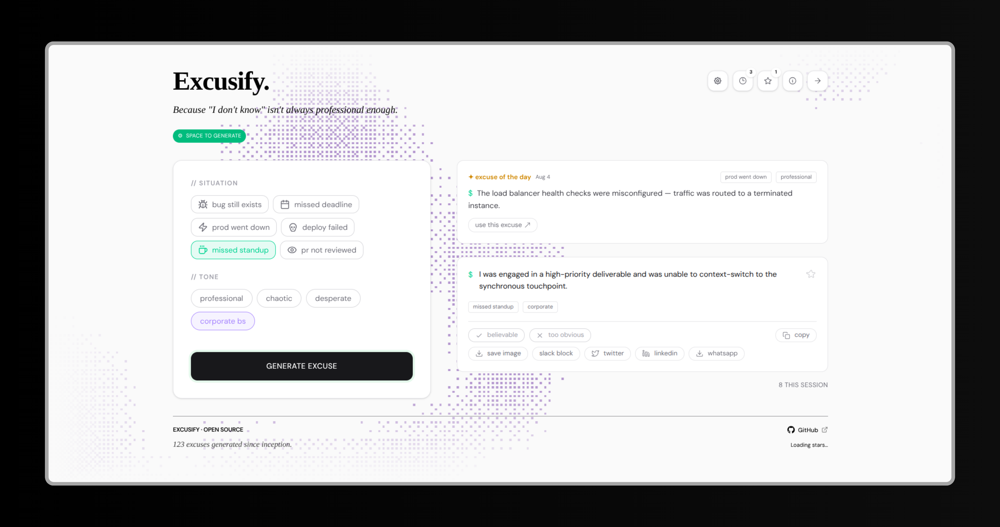

<p align="center">
  <a href="https://excusify.vercel.app/">
    
  </a>
</p>

<h1 align="center">Excusify</h1>

<p align="center">
  A modern, open-source excuse generator for developers, teams, and anyone who needs a quick, professional-sounding reason. Choose from six situations, four tones, and generate the perfect excuse in seconds, right in your browser.
</p>

<p align="center">
  
  
  
  
  
  
</p>

<p align="center">
  <a href="https://excusify.vercel.app/">Live Demo</a>
  •
  <a href="https://github.com/byllzz/excusify/issues/new">Report Bug</a>
  •
  <a href="https://github.com/byllzz/excusify/issues/new">Request Feature</a>
</p>


# About Excusify

**Excusify** is an open-source excuse generator built for developers, teams, and anyone who's ever needed a quick, believable reason to explain a missed deadline, bug, or deployment failure.

It combines a curated collection of situations and tones into a clean, responsive interface that lets you generate, save, and share excuses with just a few clicks.

Unlike generic excuse generators, **Excusify** is tailored specifically for the engineering world. Choose from six realistic situations such as **Bug Still Exists**, **Deploy Failed**, or **Production Went Down**, then combine them with one of four writing styles ranging from professional to complete corporate nonsense.

Everything runs entirely inside your browser.

- No external APIs
- No server-side processing
- No tracking
- Fully client-side
- Favorites and history stored locally using `localStorage`

Your data never leaves your device.


# Features

Excusify combines a polished interface, curated excuse library, sharing tools, and privacy-first architecture into one lightweight application.

| Category | Features |
|-----------|----------|
| **Situations** | Bug Still Exists • Missed Deadline • Production Went Down • Deploy Failed • Missed Standup • PR Not Reviewed |
| **Tones** | Professional • Chaotic • Desperate • Corporate BS |
| **Excuse Generator** | Random generation • Avoid repeated excuses • Spacebar shortcut |
| **Favorites** | Save up to 20 excuses • Remove individually • Clear all |
| **History** | Stores last 10 generated excuses • Copy previous excuses • Clear history |
| **Rating** | Mark excuses as *Believable* or *Too Obvious* |
| **Sharing** | Copy Text • Slack Format • PNG Export • Twitter • LinkedIn • WhatsApp • Slack |
| **Keyboard Shortcuts** | Space • S • T • C • F • ? |
| **Excuse of the Day** | Daily deterministic excuse based on the current date |
| **Theme** | Light & Dark Mode with persistent preference |
| **Settings** | Auto Copy • Sound Effects • Update URL • Show/Hide Hints • Counter • Excuse of the Day • Clear Local Data |
| **Privacy** | 100% Client-side • No Tracking • No Analytics • No APIs |


# Architecture

Excusify is built around a simple idea: every generated excuse should be **consistent**, **shareable**, and completely **independent from the user interface**.

The application uses a centralized excuse generator that selects a random excuse from the chosen **situation** and **tone** combination. The React interface simply captures user selections, passes them to the generator, and displays the result.

All generated excuses, favorites, settings, and history are stored locally using **localStorage**, allowing data to persist between browser sessions without relying on external services.

Everything runs entirely inside the browser.

- No backend
- No APIs
- No databases
- No authentication
- No tracking

This keeps the application lightweight, fast, and privacy-friendly.


# Adding a New Excuse

Expanding Excusify only requires two simple steps.

## Step 1 - Add the Excuses

Open:

```text
src/data/excuses.js
```

Add a new situation along with its available tones.

```js
"new situation": {
  professional: [
    "Excuse 1",
    "Excuse 2"
  ],
  chaotic: [
    "Excuse A",
    "Excuse B"
  ],
  desperate: [],
  corporate: []
}
```


## Step 2 - Register the Situation (Optional)

If you'd like the new situation to appear in the situation picker, open:

```text
src/data/situations.js
```

Add a new entry:

```js
{
  id: 7,
  label: "New Situation",
  icon: YourIcon
}
```

Once added, the new excuses automatically become available throughout the application without requiring any additional configuration.


# Project Structure

```text
excusify
├── public
├── src
│   ├── components
│   │   ├── layout
│   │   ├── modals
│   │   ├── pickers
│   │   ├── sections
│   │   └── ui
│   ├── data
│   ├── hooks
│   ├── lib
│   ├── utils
│   ├── App.jsx
│   ├── main.jsx
│   └── index.css
├── package.json
└── vite.config.js
```
# Performance

Excusify is optimized for a fast, lightweight experience.

- **Memoized Components** reduce unnecessary re-renders.
- **Local Persistence** stores favorites, history, and settings using `localStorage`.
- **Zero Network Requests** because everything runs client-side.
- **Optimized Rendering** keeps interactions smooth across modern browsers.

# Built With

Excusify is built using a modern frontend stack focused on performance, maintainability, and developer experience.

| Technology | Purpose |
|------------|---------|
| **React** | Component-based user interface |
| **Vite** | Fast development server and optimized production builds |
| **Tailwind CSS v4** | Utility-first styling framework |
| **JavaScript (ES6+)** | Core application logic |
| **Lucide React** | Modern icon library |
| **React Icons** | Additional icon collections |
| **html2canvas** | Export excuse cards as PNG images |

<p align="left">
  
</p>


# Getting Started

Running Excusify locally only takes a few minutes.

## Prerequisites

Before getting started, make sure you have the following installed:

- Node.js (Latest LTS recommended)
- npm or Yarn
- A modern web browser (Chrome, Edge, Firefox, or Safari)


## Installation

### 1. Clone the repository

```bash
git clone https://github.com/byllzz/excusify.git
```

### 2. Navigate to the project

```bash
cd excusify
```

### 3. Install dependencies

```bash
npm install
```

### 4. Start the development server

```bash
npm run dev
```

Once the server is running, open the local URL displayed in your terminal.

---

# Production Build

Create an optimized production build:

```bash
npm run build
```

Preview the production build locally:

```bash
npm run preview
```


# Contributing

Contributions of every size are welcome.

Whether you're fixing a typo, improving accessibility, optimizing performance, adding new excuse categories, or introducing an entirely new feature, every contribution helps make **Excusify** better.

Before opening a pull request, take a moment to understand how the project is organized. Most additions only require changes inside the data files thanks to the application's modular architecture.

## Adding a New Excuse

### 1. Add the Excuses

Open:

```text
src/data/excuses.js
```

Add your new situation and its tone variations.

### 2. Register the Situation (Optional)

Open:

```text
src/data/situations.js
```

Add a new picker entry with a unique `id` and icon.

Once completed, the new excuses automatically become available throughout the application without any additional configuration.

---

# Author

<p align="left">
  
</p>

<h3 align="left">Bilal Malik</h3>

<p align="left">

[](https://github.com/byllzz)
[](https://x.com/bilalmlkdev)
[](https://bilalmlkdev.vercel.app)
[](https://www.linkedin.com/in/bilalmlkdev/)
[](mailto:bilalmlkdev@gmail.com)

</p>

<p align="right">
<a href="#excusify">⬆ Back to Top</a>
</p>


# License

This project is licensed under the **MIT License**.

```text
MIT License

Copyright (c) 2026 Bilal Malik

Permission is hereby granted, free of charge, to any person obtaining a copy
of this software and associated documentation files (the "Software"), to deal
in the Software without restriction, including without limitation the rights
to use, copy, modify, merge, publish, distribute, sublicense, and/or sell
copies of the Software, and to permit persons to whom the Software is
furnished to do so, subject to the following conditions:

The above copyright notice and this permission notice shall be included in all
copies or substantial portions of the Software.

THE SOFTWARE IS PROVIDED "AS IS", WITHOUT WARRANTY OF ANY KIND, EXPRESS OR
IMPLIED, INCLUDING BUT NOT LIMITED TO THE WARRANTIES OF MERCHANTABILITY,
FITNESS FOR A PARTICULAR PURPOSE AND NONINFRINGEMENT. IN NO EVENT SHALL THE
AUTHORS OR COPYRIGHT HOLDERS BE LIABLE FOR ANY CLAIM, DAMAGES OR OTHER
LIABILITY, WHETHER IN AN ACTION OF CONTRACT, TORT OR OTHERWISE, ARISING FROM,
OUT OF OR IN CONNECTION WITH THE SOFTWARE OR THE USE OR OTHER DEALINGS IN THE
SOFTWARE.
```


<p align="left">
© 2026 <strong>Excusify</strong>. Licensed under the MIT License.
</p>

---

